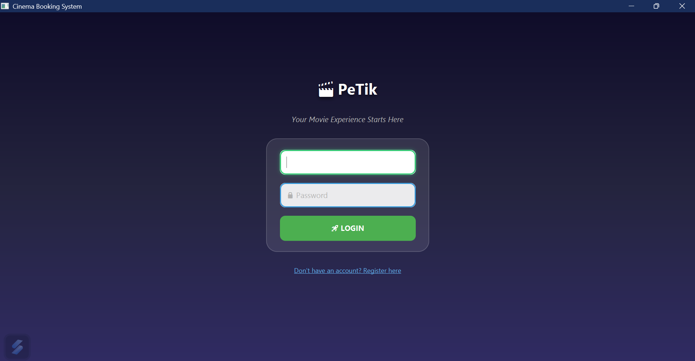
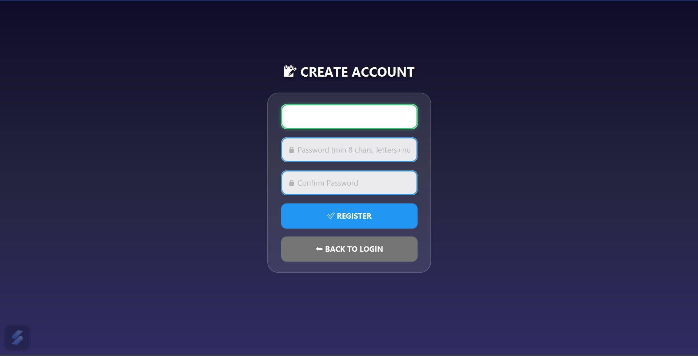
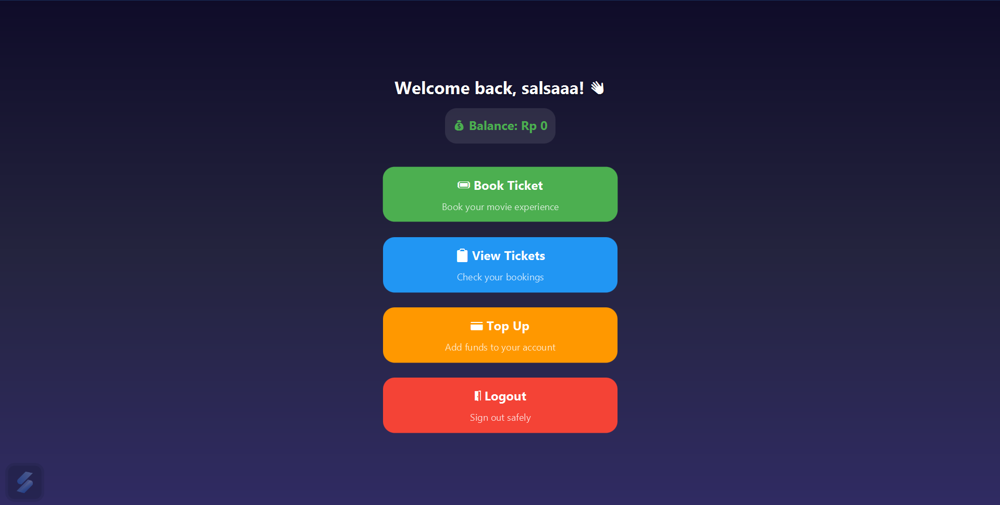
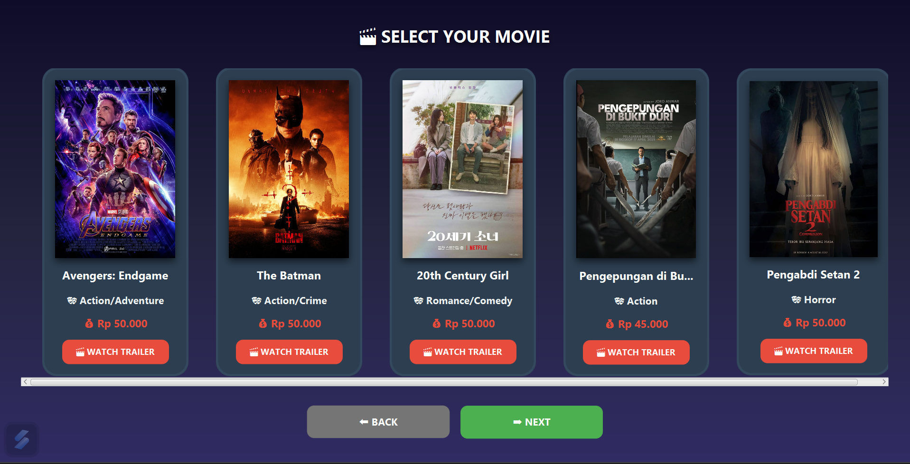
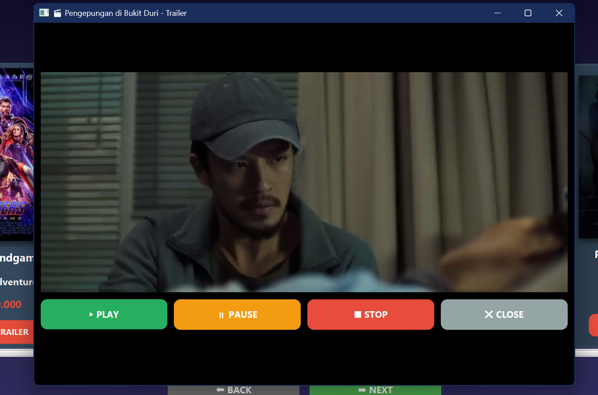
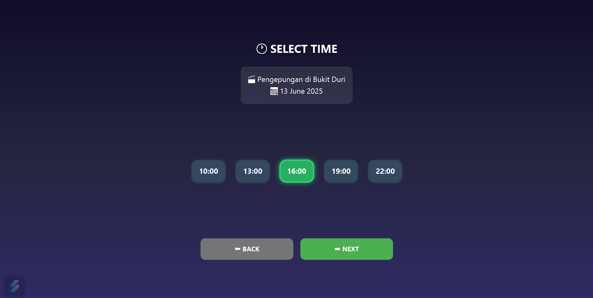
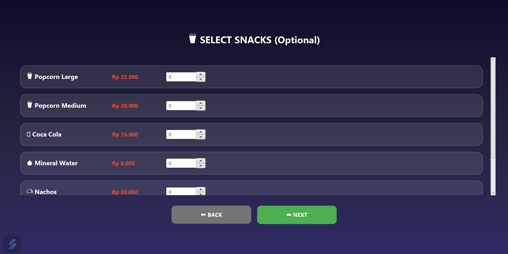
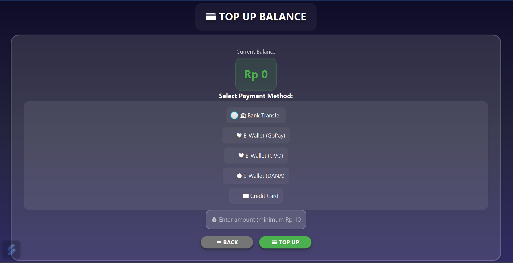

<h1 align="center"> 
    🎬 PETIK - Pesan Tiket
</h1> 
    <p align="center"> 
        <b> 
        Aplikasi Pemesanan Tiket Bioskop
        </b> 
    </p>


## 📝 Deskripsi Proyek
PETIK atau Pemesanan Tiket merupakan aplikasi yang dibangun menggunakan JavaFX sebagai bagian dari proyek akhir praktikum Pemrograman Berbasis Objek pada semester dua. Aplikasi ini bertujuan untuk mempermudah pengguna dalam melakukan pemesanan tiket bioskop secara digital. Melalui PETIK, pengguna dapat menelusuri jadwal film, memilih kursi sesuai keinginan, dan melakukan reservasi tiket dengan mudah. Fitur-fitur yang disediakan dirancang untuk memberikan pengalaman pemesanan yang cepat, nyaman, dan terintegrasi.

---

## 🎬 Fitur Utama

1. ✅*Registrasi dan Login Akun*: Pengguna dapat membuat akun baru dengan mengisi data berupa Username dan Password untuk dan Login dengan akun tersebut untuk  mulai menggunakan aplikasi.
2. 🎞*Lihat dan Putar Film*: Menampilkan daftar film serta memutar thriller film yang tersedia.
3. ⏰ *Pilih Jadwal Tayang*: Pengguna dapat memilih jadwal tayang film sesuai preferensi waktu.
4. 💺 *Reservasi Kursi*: Menyediakan visualisasi kursi teater dan memungkinkan pengguna memilih kursi yang masih tersedia.
5. 🍟 *Pemesanan Snack*: Pengguna dapat menambahkan makanan atau minuman sebagai bagian dari pembelian tiket.
6. 💳 *Manajemen Saldo Balance: Pengguna dapat melihat dan mengatur saldo, termasuk fitur *top-up untuk menambahkan dana sebelum melakukan transaksi.

---

## 📂 Struktur Proyek

```plaintext
PeTik/
├──app
|   ├──src
|   |   ├──main 
|   |   |   ├──java
|   |   |   |    ├──finalLab
|   |   |   |           ├──Controller   # Folder yang berisi
|   |   |   |           ├──Model        #
|   |   |   |           ├──Service      #
|   |   |   |           ├──Main.java    # pintu masuk App
|   |   |   |
|   |   |   ├──resources
|   |   |          ├──images
|   |   |          ├──trailers
```

---

## 🧩 Penerapan 4 Pilar OOP 

### 1. 🔒 Encapsulation

*Tujuan*: Menyembunyikan detail implementasi dan hanya mengekspos yang dibutuhkan melalui method publik.

#### Diterapkan di:
- *Model*:
  - User, Movie, Ticket: Menggunakan private field dan public getter/setter.
- *Service*:
  - UserManager, BookingManager, dll: Menyediakan method publik untuk memanipulasi data pengguna, film, dan tiket tanpa mengekspos langsung detail struktur penyimpanan.

---

### 2. 🧬 Inheritance 

*Tujuan*: Memungkinkan kelas untuk mewarisi atribut dan method dari kelas lain.

#### Diterapkan di:
- *Controller*:
  - Semua controller (AuthController, BookingController, TopUpController, dll) mewarisi dari BaseController, yang menyediakan method umum seperti setScene dan showMessage.
- *Service*:
  - BaseFileService digunakan sebagai kelas induk untuk UserManager, MovieManager, dan BookingManager, yang berbagi logika pemrosesan file dasar.

---

### 3. 🌀 Polymorphism 

*Tujuan*: Memungkinkan satu antarmuka digunakan untuk berbagai jenis objek.

#### Diterapkan di:
- *Service*:
  - IFileService sebagai interface untuk layanan berbasis file, yang diimplementasikan oleh beberapa kelas seperti UserManager, MovieManager, BookingManager. Ini memungkinkan pemanggilan method readFromFile() atau writeToFile() tanpa peduli jenis objek spesifik.
- *Controller*:
  - Polimorfisme melalui overriding method show() di berbagai controller yang diwarisi dari BaseController.

---

### 4. 🧊 Abstraction 

*Tujuan*: Menyembunyikan kompleksitas dan hanya menampilkan fungsionalitas yang relevan kepada pengguna.

#### Diterapkan di:
- *Controller*:
  - Setiap controller menyederhanakan interaksi UI menjadi fungsi-fungsi seperti showLoginForm, showTopUpScene, dll, tanpa harus menunjukkan bagaimana JavaFX bekerja secara internal.
- *Service*:
  - BaseFileService dan interface IFileService menyembunyikan detail pembacaan/penulisan file dari controller atau model.

---

## 🛠 Cara menjalankan projek

1. Pastikan Anda sudah menginstal 
    - *Java Development Kit (JDK) 23*
    - *Gradle versi 8.8*

2. Clone repository ini ke komputer Anda menggunakan Git:

    ```bash
    git clone https://github.com/sophieamrie/PETIK.git
    ```

3. Masuk ke direktori proyek:

    ```bash
    cd PETIK/PeTik
    ```
    
5. Bangun proyek dengan perintah berikut:

    ```bash
    gradle build
    ```

6. Jalankan aplikasi menggunakan perintah berikut:

    ```bash
    gradle run
    ```

7. Aplikasi akan terbuka dengan tampilan login. Anda dapat mendaftar akun baru atau login jika sudah memiliki akun.

8. Setelah masuk, Anda dapat:
    - Memilih film dan waktu tayang
    - Memutar thriller film
    - Memilih kursi dan snack
    - Melakukan pembayaran dengan saldo
    - Top up saldo jika diperlukan

---

## 📸 Dokumentasi App

*1. Register & Login*




*2. Menu Utama*


*3. Pilih film & waktu tayang, putar thriller, reservasi kursi dan pembelian snack*









*4. Top saldo*


---

## 👥 Kontributor

*KELOMPOK 19*
- Andi Sophie Banuna Amrie
- Andi Eryn Nur Alisya
- Nabila Salsabila

<a href="https://github.com/sophieamrie/KLP7-FINAL/graphs/contributors">
  
</a>